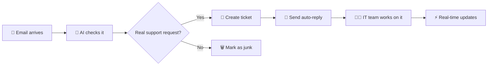

<div align="center">

# 🎯 CIS Support Pro

### Built by Samuel for the IT team at Children's International School Lagos

[](https://nextjs.org/)
[](https://www.typescriptlang.org/)
[](https://supabase.com/)
[](https://tailwindcss.com/)

*Because dealing with cluttered email threads and lost tickets is so 2020* 📧❌

</div>

---

## 🤔 What is this?

This is a custom-built help desk system I created to replace our old cluttered ticket system. Instead of dealing with messy email threads and losing track of requests, we now have a clean dashboard where the IT team can see everything at a glance.

The system automatically pulls emails from our support inbox (`cishelpdesk@cislagos.org`), creates tickets, and even uses AI to filter out spam and marketing emails so we only see real support requests.

## 💡 Why I built this

Working IT support at CIS Lagos, I got tired of:

- 📨 Digging through email threads to find ticket details
- 🤷‍♂️ Losing track of who's working on what
- 🗑️ Spam and marketing emails mixed with real support requests
- 📝 No easy way to add internal notes without emailing everyone

So I built this. It's designed specifically for how **we** work at CIS.

---

## ✨ Features

| Feature | Description |
|---------|-------------|
| 📬 **Email Integration** | Automatically pulls emails from Gmail and creates tickets |
| 🤖 **AI Triage** | Uses Groq AI to filter junk emails (newsletters, marketing, etc.) |
| 📊 **Clean Dashboard** | See all open tickets, who they're assigned to, and their status |
| 💬 **Internal Notes** | Add notes that only IT staff can see |
| ⚡ **Real-time Updates** | When someone updates a ticket, everyone sees it instantly |
| 🌙 **Dark Mode** | Because we're in the server room a lot |

---

## 🛠️ Tech Stack

<table>
<tr>
<td align="center" width="96">

<br>Next.js 15
</td>
<td align="center" width="96">

<br>TypeScript
</td>
<td align="center" width="96">

<br>Supabase
</td>
<td align="center" width="96">

<br>Tailwind CSS
</td>
</tr>
</table>

Plus: **Groq AI** for email classification (free and blazing fast ⚡)

---

## 🚀 Setup

If you're setting this up for another school or organization:

### 1️⃣ Clone and install

```bash
git clone <repo-url>
cd "IT SUPPORT"
npm install
```

### 2️⃣ Set up Supabase

- Create a project at [supabase.com](https://supabase.com)
- Run the migrations in `supabase/migrations/` in order (001 → 006)
- Copy your project URL and keys to `.env.local`

### 3️⃣ Set up Gmail

- Create a Google Cloud project
- Enable Gmail API
- Create OAuth2 credentials
- Run `node scripts/get-gmail-token.js` to get your refresh token
- Add credentials to `.env.local`

### 4️⃣ Set up AI (optional but recommended)

- Get a free API key from [groq.com](https://groq.com)
- Add to `.env.local` as `GROQ_API_KEY`

### 5️⃣ Run it

```bash
npm run dev
```

Open [http://localhost:3000](http://localhost:3000) and you're good to go! 🎉

---

## 🔄 How it works



1. **Email comes in** → Gmail API fetches it
2. **AI checks it** → Groq determines if it's a real support request or junk
3. **Ticket created** → Real requests become tickets in the dashboard
4. **Auto-reply sent** → Customer gets a confirmation email with ticket number
5. **IT team works on it** → Assign, add notes, update status
6. **Real-time updates** → Everyone sees changes instantly

---

## 📁 Project Structure

```
IT SUPPORT/
├── 📱 app/
│   ├── dashboard/              # Main ticket dashboard
│   ├── api/cron/process-emails # Email processing endpoint
│   └── actions/                # Server actions (assign, add notes, etc.)
├── 🧩 components/
│   ├── ticket-list.tsx         # Ticket table
│   ├── ticket-detail.tsx       # Ticket details sidebar
│   └── ticket-notes.tsx        # Internal notes
├── 📚 lib/
│   ├── gmail/                  # Gmail API integration
│   └── triage/                 # AI email classification
└── 🗄️ supabase/migrations/     # Database schema
```

---

## 🔐 Environment Variables

Copy `.env.local` and fill in your credentials:

```env
# Supabase
NEXT_PUBLIC_SUPABASE_URL=your_url
NEXT_PUBLIC_SUPABASE_ANON_KEY=your_key
SUPABASE_SERVICE_ROLE_KEY=your_service_key

# Gmail OAuth
GMAIL_CLIENT_ID=your_client_id
GMAIL_CLIENT_SECRET=your_secret
GMAIL_REFRESH_TOKEN=your_refresh_token
GMAIL_INBOX_EMAIL=your_support_email

# AI (optional)
GROQ_API_KEY=your_groq_key

# Cron security
CRON_SECRET=random_string
```

---

## 🚢 Deployment

I deployed this on **Vercel**:

1. Push to GitHub
2. Import to Vercel
3. Add environment variables
4. Deploy
5. Set up a cron job to hit `/api/cron/process-emails` every 5 minutes

**Live at:** `https://cis-pro-support.vercel.app`

---

## 📝 Notes

- ✅ Built specifically for CIS Lagos IT team workflows
- ✅ Email replies to tickets automatically become notes
- ✅ The triage system learns from our patterns
- ✅ All internal - no customer-facing portal (yet)

---

## 🤝 Questions?

**CIS Lagos IT team:** You know where to find me 😉

**Other schools:** Feel free to use this! Just know it's built for our specific setup. You might need to tweak things.

---

## ☕ Support

If this project helped you or your school, consider buying me a coffee! It helps keep the late-night coding sessions going ☕

<div align="center">

[](https://buymeacoffee.com/yourusername)
[](https://paypal.me/yourusername)
[](https://ko-fi.com/yourusername)
[](https://github.com/sponsors/yourusername)

**Crypto:**

- **Bitcoin (BTC):** `your-btc-address`
- **Ethereum (ETH):** `your-eth-address`
- **USDT (TRC20):** `your-usdt-address`

</div>

---

<div align="center">

### Built with ☕ and late nights in the CIS server room

**Made with ❤️ by Samuel**

</div>
