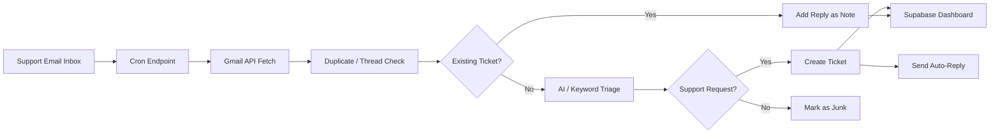

<div align="center">

# CIS Support Pro

### Internal IT Helpdesk Platform for Children's International School Lagos

[](https://nextjs.org/)
[](https://www.typescriptlang.org/)
[](https://supabase.com/)
[](https://tailwindcss.com/)

A custom IT service management system that converts support emails into trackable tickets, supports role-based workflows, and gives the IT team a real-time operational dashboard.

</div>

---

## Overview

CIS Support Pro is a custom-built helpdesk platform designed for the IT operations workflow at Children's International School Lagos. It replaces scattered support inbox activity with a structured ticket queue, automated email intake, AI-assisted triage, internal notes, assignment tracking, and role-aware dashboards.

The system connects to a support Gmail inbox, processes unread emails, filters noise, creates tickets for valid support requests, detects email replies, and appends follow-ups to existing tickets instead of creating duplicates.

---

## Problem Solved

The previous support workflow relied heavily on email threads and manual tracking, which created several operational problems:

- Support requests could be buried in long inbox threads.
- It was difficult to see which technician owned each issue.
- Replies and follow-ups could become disconnected from the original request.
- Spam, newsletters, and automated notifications mixed with real IT requests.
- The team lacked a single operational dashboard for queue visibility.

CIS Support Pro centralizes this workflow into a dashboard built around ticket ownership, status, priority, internal notes, and real-time updates.

---

## Key Features

| Feature | Description |
| --- | --- |
| Email-to-ticket intake | Pulls unread support emails from Gmail and creates structured tickets. |
| AI-assisted triage | Uses Groq/OpenAI-compatible classification with keyword fallback for reliability. |
| Duplicate prevention | Tracks processed Gmail message IDs and Gmail thread IDs to reduce duplicate tickets. |
| Reply handling | Adds email replies to existing tickets as internal notes when thread or subject matching succeeds. |
| Role-based dashboard | Supports technician, supervisor, HOD, and SIMS manager workflows. |
| SIMS ticket separation | Keeps SIMS-related requests visible to SIMS-specific roles while filtering them from general technician queues. |
| Internal notes | Allows ticket discussion and follow-up tracking without replying to the full email thread. |
| Real-time updates | Uses Supabase real-time subscriptions so queue changes appear without manual refresh. |
| Ticket board and list views | Supports both tabular queue review and Kanban-style ticket movement. |
| Cron-secured processing | Protects the email processor endpoint with a bearer token secret. |

---

## Tech Stack

| Area | Technology |
| --- | --- |
| Frontend | Next.js 15, React 19, TypeScript |
| Styling | Tailwind CSS, Radix UI, Lucide React |
| Backend | Next.js App Router, Server Actions, API Routes |
| Database/Auth | Supabase |
| Email Integration | Gmail API via OAuth2 or Google Workspace service account |
| AI Triage | Groq/OpenAI-compatible chat completion API with keyword fallback |
| Deployment | Vercel |

---

## Architecture


```mermaid
graph LR
    A[Support Email Inbox] --> B[Cron Endpoint]
    B --> C[Gmail API Fetch]
    C --> D[Duplicate / Thread Check]
    D --> E{Existing Ticket?}
    E -->|Yes| F[Add Reply as Note]
    E -->|No| G[AI / Keyword Triage]
    G --> H{Support Request?}
    H -->|Yes| I[Create Ticket]
    H -->|No| J[Mark as Junk]
    I --> K[Send Auto-Reply]
    I --> L[Supabase Dashboard]
    F --> L
```

### Email Processing Flow

1. A secured cron request hits `/api/cron/process-emails`.
2. The system verifies the `CRON_SECRET` bearer token.
3. Gmail unread inbox messages are fetched.
4. Already processed message IDs are skipped.
5. Gmail thread IDs are checked against existing tickets.
6. Replies are added as notes instead of creating duplicate tickets.
7. New emails are classified as support requests or junk.
8. Valid support requests become tickets.
9. Auto-replies are sent to the requester.
10. Tickets appear in the real-time dashboard.

---

## Project Structure

```txt
cis-support-pro/
├── app/
│   ├── actions/                 # Server actions for dashboard data and ticket operations
│   ├── api/cron/process-emails/  # Secured Gmail email-processing endpoint
│   ├── auth/                     # Login and authentication routes
│   └── dashboard/                # Protected IT dashboard pages
├── components/                   # Dashboard, ticket, filter, board, and UI components
├── lib/
│   ├── gmail/                    # Gmail client, fetching, sending, and templates
│   ├── supabase/                 # Supabase browser/server/middleware clients
│   ├── triage/                   # AI and keyword-based email classification
│   └── types.ts                  # Shared application types
├── public/                       # Static assets
└── supabase/migrations/          # Database schema migrations
```

---

## Environment Variables

Create a `.env.local` file using `.env.example` as a reference.

```env
# Supabase
NEXT_PUBLIC_SUPABASE_URL=
NEXT_PUBLIC_SUPABASE_ANON_KEY=
SUPABASE_SERVICE_ROLE_KEY=

# Gmail OAuth2 option
GMAIL_CLIENT_ID=
GMAIL_CLIENT_SECRET=
GMAIL_REFRESH_TOKEN=

# Google Workspace service account option
GOOGLE_SERVICE_ACCOUNT_EMAIL=
GOOGLE_PRIVATE_KEY=
GMAIL_INBOX_EMAIL=

# AI triage
GROQ_API_KEY=
OPENAI_API_KEY=

# Cron security
CRON_SECRET=
```

> Never commit real API keys, Gmail refresh tokens, service role keys, or private keys.

---

## Local Setup

```bash
git clone https://github.com/sxmuel-py/cis-support-pro.git
cd cis-support-pro
npm install
cp .env.example .env.local
npm run dev
```

Open `http://localhost:3000`.

---

## Supabase Setup

1. Create a Supabase project.
2. Run the migrations in `supabase/migrations/` in order.
3. Add the Supabase URL, anon key, and service role key to `.env.local`.
4. Configure authentication for authorized IT staff accounts.
5. Ensure row-level security policies match the intended role-based access model.

---

## Gmail Setup

The application supports two Gmail authentication modes:

### OAuth2

Use this for a bot mailbox or personal Gmail-style integration.

Required variables:

```env
GMAIL_CLIENT_ID=
GMAIL_CLIENT_SECRET=
GMAIL_REFRESH_TOKEN=
```

### Google Workspace Service Account

Use this for Workspace environments with domain-wide delegation.

Required variables:

```env
GOOGLE_SERVICE_ACCOUNT_EMAIL=
GOOGLE_PRIVATE_KEY=
GMAIL_INBOX_EMAIL=
```

---

## Deployment Notes

This project is designed to run on Vercel.

1. Import the repository into Vercel.
2. Add all required environment variables.
3. Deploy the application.
4. Configure a scheduled job to call:

```txt
GET /api/cron/process-emails
Authorization: Bearer <CRON_SECRET>
```

Recommended schedule: every 5 minutes, depending on mailbox volume and operational needs.

---

## Security Notes

- The email processor is protected by `CRON_SECRET`.
- Supabase service role usage is limited to backend processing routes.
- Dashboard access is protected through Supabase authentication.
- Ticket visibility is filtered by user role.
- Secrets must be configured through environment variables only.
- The AI triage layer should be treated as advisory; final workflow decisions should remain auditable through ticket history.

---

## Current Status

CIS Support Pro is an internal operational tool built around real IT support workflows. The current version includes email intake, ticket creation, role-based dashboard views, AI-assisted classification, duplicate handling, reply-to-note handling, and real-time queue updates.

Planned improvements may include SLA tracking, reporting exports, user-facing ticket status pages, improved Gmail threading headers, and stronger transactional guarantees during email processing.

---

## Author

Built by Samuel Olatidoye as a custom internal IT support platform for school IT operations.
